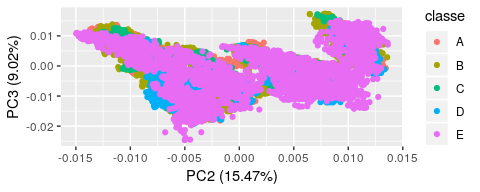

Final Assignment - Practical Machine Learning - Coursera
========================================================

by Simon J. Baumgart
--------------------

Introduction and background
---------------------------

### Objective:

One thing that people regularly do is quantify how much of a particular
activity they do, but they rarely quantify how well they do it. In this
project, the goal was to use data from accelerometers on the belt,
forearm, arm, and dumbell of 6 participants and *predict* how well they
were doing the excercize compared to different compared movements:

-   exactly according to the specification (Class A),
-   throwing the elbows to the front (Class B)
-   lifting the dumbbell only halfway (Class C)
-   lowering the dumbbell only halfway (Class D)
-   throwing the hips to the front (Class E)

Review Criteria:
----------------

The goal of this project is to predict the manner in which they did the
exercise. This is the "classe" variable in the training set. You may use
any of the other variables to predict with. You should create a report
describing how you built your model, how you used cross validation, what
you think the expected out of sample error is, and why you made the
choices you did. You will also use your prediction model to predict 20
different test cases.

### Background:

Using devices such as Jawbone Up, Nike FuelBand, and Fitbit it is now
possible to collect a large amount of data about personal activity
relatively inexpensively. These type of devices are part of the
quantified self movement – a group of enthusiasts who take measurements
about themselves regularly to improve their health, to find patterns in
their behavior, or because they are tech geeks. One thing that people
regularly do is quantify how much of a particular activity they do, but
they rarely quantify how well they do it. In this project, your goal
will be to use data from accelerometers on the belt, forearm, arm, and
dumbell of 6 participants. They were asked to perform barbell lifts
correctly and incorrectly in 5 different ways. More information is
available from the website here:
<http://web.archive.org/web/20161224072740/http:/groupware.les.inf.puc-rio.br/har>
(see the section on the Weight Lifting Exercise Dataset).

### Data & Material

The training data for this project are available here:

<https://d396qusza40orc.cloudfront.net/predmachlearn/pml-training.csv>

The test data are available here:

<https://d396qusza40orc.cloudfront.net/predmachlearn/pml-testing.csv>

Standard laptop PC for model prediction.

Results
-------

### data exploration & identification of important predictor variables

### dimension of the datasets

#### pca plot

**plot1**  
The data is mainly distributed by the training individuals looking at
the different PC

**plot2**  
When plotting the different "classe" variables it appears that there is
**no** clear difference between the "classes" and that they get
distributed well. They rather get distributed by individuals who
performed the test. Therefore, I would like to identify key variables.

### reducing the number variables

Because there are many variables (160) in the dataset and the model
prediction runs on a normal PC the variable reduction will save time and
might reduce the risk of overfitting.

**plot3** variable selection out of the dataset

The cos2 indicates how much a variable is contributing to explain the
variance in dimensions within the PC. I selected here for the **top 30
variables** explaining the most variability within the first 5
dimensions of the PCA.

### fitting the model to the test data by a random forest

    x <- as.data.frame(trainingdata_NArm_tidy.outRM.selected[,-c(1,which(colnames(trainingdata_NArm_tidy.outRM.selected) == "classe"))])
    y <- trainingdata_NArm_tidy.outRM.selected$classe

    fitControl <- trainControl(method = "cv",
                               number = 5,
                               allowParallel = TRUE)

    cluster <- makeCluster(detectCores() - 1) # convention to leave 1 core for OS
    registerDoParallel(cluster)

    mod2 <- train(x,y,method="rf", data=trainingdata_NArm_tidy.outRM.selected, trControl = fitControl, ntree=25)

    stopCluster(cluster)
    registerDoSEQ()

**Explanation why I choose this model:**  
I use parallel computing to accelerate the process. The Random Forest
method is used because it is a powerful method as in the lectures
explained and might be advantageous over a "glm" or "lm". I use here
number of trees: 25. In addition random forest has been also used in the
publication underlying this data. To improve our prediction I am using
here a 5 fold cross-validation resampling technique. As an alternative
bootstrapping technique could have been used.

[why to use parallel computing in this
assignment](https://github.com/lgreski/datasciencectacontent/blob/master/markdown/pml-randomForestPerformance.md)

    mod2$finalModel

    ## 
    ## Call:
    ##  randomForest(x = x, y = y, ntree = 25, mtry = param$mtry, data = ..1) 
    ##                Type of random forest: classification
    ##                      Number of trees: 25
    ## No. of variables tried at each split: 15
    ## 
    ##         OOB estimate of  error rate: 0.34%
    ## Confusion matrix:
    ##      A    B    C    D    E  class.error
    ## A 5574    4    0    0    0 0.0007171029
    ## B    8 3779    7    2    0 0.0044783983
    ## C    0   10 3406    6    0 0.0046756283
    ## D    0    1   16 3190    9 0.0080845771
    ## E    0    0    0    4 3603 0.0011089548

The out-of-bag error (OOB), which is the estimate of the error rate is
with under 1% reasonable. The most difficult class to predict is the
class E which is the "throwing the hips to the front". We however get a
good and low class error for the "correct" exercise which is class A.

**crossvalidation on a training subset split at the beginning** (which
is not included in the model building of course)

    crossvalidpredict.select <- crossvaliddata[,grepl(colnames(crossvaliddata), pattern =paste(patternmatch, collapse = "|"))]
    crossvalidpredict <- predict(mod2, crossvalidpredict.select)
    table(crossvalidpredict.select$classe,crossvalidpredict)

    ##    crossvalidpredict
    ##       A   B   C   D   E
    ##   A 837   0   0   0   0
    ##   B   0 569   0   0   0
    ##   C   0   0 513   0   0
    ##   D   0   0   0 482   0
    ##   E   0   0   0   0 541

    accuracy(crossvalidpredict.select$classe,crossvalidpredict)[1]

    ## $PCC
    ## [1] 100

**The evaluation of the test set**

    testing.selected  <- testingdata[,grepl(colnames(testingdata), pattern =paste(patternmatch, collapse = "|"))]
    pred <- predict(mod2, testing.selected)
    pred

    ##  [1] B A B A A E D B A A B C B A E E A B B B
    ## Levels: A B C D E

Conclusion
----------

The random forest model used here predicts well on a split sample set at
the beginning and as well on the training set. It will be thrilling to
see what the outcome is on the test dataset. The hardest to predicted
class in our model is class E. The best prediction with the lowest class
error rate we get with the class A. This is desirable because we want to
know how to train best!

Thank you for your time and grading.

Apendix
-------

### What to submit:

Your submission for the Peer Review portion should consist of a link to
a Github repo with your R markdown and compiled HTML file describing
your analysis. Please constrain the text of the writeup to &lt; 2000
words and the number of figures to be less than 5. It will make it
easier for the graders if you submit a repo with a gh-pages branch so
the HTML page can be viewed online (and you always want to make it easy
on graders :-).

code book
---------

    #download.file(url = "https://d396qusza40orc.cloudfront.net/predmachlearn/pml-training.csv", destfile = "~/Data_Science/course 8 - practical machine learning/data/pml-training.csv")
    #download.file(url = "https://d396qusza40orc.cloudfront.net/predmachlearn/pml-testing.csv", destfile = "~/Data_Science/course 8 - practical machine learning/data/pml-testing.csv")
    trainingdata <- read_csv("~/Data_Science/course 8 - practical machine learning/data/pml-training.csv")

    ## Warning: Missing column names filled in: 'X1' [1]

    ## Parsed with column specification:
    ## cols(
    ##   .default = col_double(),
    ##   user_name = col_character(),
    ##   cvtd_timestamp = col_character(),
    ##   new_window = col_character(),
    ##   kurtosis_roll_belt = col_character(),
    ##   kurtosis_picth_belt = col_character(),
    ##   kurtosis_yaw_belt = col_character(),
    ##   skewness_roll_belt = col_character(),
    ##   skewness_roll_belt.1 = col_character(),
    ##   skewness_yaw_belt = col_character(),
    ##   max_yaw_belt = col_character(),
    ##   min_yaw_belt = col_character(),
    ##   amplitude_yaw_belt = col_character(),
    ##   kurtosis_picth_arm = col_character(),
    ##   kurtosis_yaw_arm = col_character(),
    ##   skewness_pitch_arm = col_character(),
    ##   skewness_yaw_arm = col_character(),
    ##   kurtosis_yaw_dumbbell = col_character(),
    ##   skewness_yaw_dumbbell = col_character(),
    ##   kurtosis_roll_forearm = col_character(),
    ##   kurtosis_picth_forearm = col_character()
    ##   # ... with 8 more columns
    ## )

    ## See spec(...) for full column specifications.

    ## Warning: 182 parsing failures.
    ##  row               col expected  actual                                                                         file
    ## 2231 kurtosis_roll_arm a double #DIV/0! '~/Data_Science/course 8 - practical machine learning/data/pml-training.csv'
    ## 2231 skewness_roll_arm a double #DIV/0! '~/Data_Science/course 8 - practical machine learning/data/pml-training.csv'
    ## 2255 kurtosis_roll_arm a double #DIV/0! '~/Data_Science/course 8 - practical machine learning/data/pml-training.csv'
    ## 2255 skewness_roll_arm a double #DIV/0! '~/Data_Science/course 8 - practical machine learning/data/pml-training.csv'
    ## 2282 kurtosis_roll_arm a double #DIV/0! '~/Data_Science/course 8 - practical machine learning/data/pml-training.csv'
    ## .... ................. ........ ....... ............................................................................
    ## See problems(...) for more details.

    trainingdata.master <- trainingdata
    inTrain <- createDataPartition(y = trainingdata.master$classe, p = 0.85, list = F)

    trainingdata <- trainingdata.master[inTrain,]
    crossvaliddata <- trainingdata.master[-inTrain,] 

    testingdata <- read_csv("~/Data_Science/course 8 - practical machine learning/data/pml-testing.csv")

    ## Warning: Missing column names filled in: 'X1' [1]

    ## Parsed with column specification:
    ## cols(
    ##   .default = col_logical(),
    ##   X1 = col_double(),
    ##   user_name = col_character(),
    ##   raw_timestamp_part_1 = col_double(),
    ##   raw_timestamp_part_2 = col_double(),
    ##   cvtd_timestamp = col_character(),
    ##   new_window = col_character(),
    ##   num_window = col_double(),
    ##   roll_belt = col_double(),
    ##   pitch_belt = col_double(),
    ##   yaw_belt = col_double(),
    ##   total_accel_belt = col_double(),
    ##   gyros_belt_x = col_double(),
    ##   gyros_belt_y = col_double(),
    ##   gyros_belt_z = col_double(),
    ##   accel_belt_x = col_double(),
    ##   accel_belt_y = col_double(),
    ##   accel_belt_z = col_double(),
    ##   magnet_belt_x = col_double(),
    ##   magnet_belt_y = col_double(),
    ##   magnet_belt_z = col_double()
    ##   # ... with 40 more columns
    ## )
    ## See spec(...) for full column specifications.

Too many NA in the data, first step is to check which variables have
lots of NA

    na_list <- c()
    for(i in  1:ncol(trainingdata)){if(sum(is.na(trainingdata[,i])) > nrow(trainingdata)*2/3){
        na_list <<- append(na_list,i)
        
    }
    }

    trainingdata_NArm <- trainingdata[,-(na_list)]

    # I remove timestamp part 2 and cvtd timestamp as the inforamtion is already in timestamp_part_1
    trainingdata_NArm_tidy <- trainingdata_NArm[,-c(1,4,5)]

    #install.packages("ggfortify")
    trainingdata_NArm_tidy_PCA <- trainingdata_NArm_tidy
    trainingdata_NArm_tidy_PCA$user_name <- as.numeric(as.factor(trainingdata_NArm_tidy_PCA$user_name))
    trainingdata_NArm_tidy_PCA$new_window <- as.numeric(as.factor(trainingdata_NArm_tidy_PCA$new_window))

    trainingdata_NArm_tidy_PCA$classe <- as.numeric(trainingdata_NArm_tidy_PCA$classe)

    glimpse(trainingdata_NArm_tidy_PCA)

    glimpse(trainingdata_NArm_tidy_PCA[,-c(ncol(trainingdata_NArm_tidy_PCA))])
    trainingdata_NArm_tidy.pca <- prcomp(trainingdata_NArm_tidy_PCA[,-c(ncol(trainingdata_NArm_tidy_PCA))], center = T, scale. = T)

    autoplot(trainingdata_NArm_tidy.pca,data = trainingdata_NArm_tidy, colour = 'user_name', label = TRUE, label.size = 5)
    #5373 as outlier in eurico to remove

    autoplot(trainingdata_NArm_tidy.pca,data = trainingdata_NArm_tidy, colour = 'user_name', loadings = TRUE, loadings.colour = 'blue',
    loadings.label = TRUE, loadings.label.size = 3, x=3, y =4)

    autoplot(cluster::clara(trainingdata_NArm_tidy_PCA[,-c(ncol(trainingdata_NArm_tidy_PCA))],6))
    ## this indicates that the users have a huge implication on the variance 

    #remove outlier
    trainingdata_NArm_tidy.outRM <- trainingdata_NArm_tidy[-5373,]
    trainingdata_NArm_tidy_PCA.outRM <- trainingdata_NArm_tidy_PCA
    trainingdata_NArm_tidy_PCA.outRM <- trainingdata_NArm_tidy_PCA.outRM[-5373,]

    trainingdata_NArm_tidy_PCA.outRM.pca <- prcomp(trainingdata_NArm_tidy_PCA.outRM[,-c(ncol(trainingdata_NArm_tidy_PCA.outRM))], center = T, scale. = T)

pca plot the aim is to see first patterns within the data and how the
variance is distributed:

    autoplot(trainingdata_NArm_tidy_PCA.outRM.pca ,data = trainingdata_NArm_tidy.outRM, colour = 'user_name')
    autoplot(trainingdata_NArm_tidy_PCA.outRM.pca ,data = trainingdata_NArm_tidy.outRM, colour = 'user_name', x = 2, y = 3)
    autoplot(trainingdata_NArm_tidy_PCA.outRM.pca ,data = trainingdata_NArm_tidy.outRM, colour = 'user_name', label.size = 5, x = 3, y =4)

Interpretation: The user has a huge influence on the variance

    autoplot(trainingdata_NArm_tidy_PCA.outRM.pca ,data = trainingdata_NArm_tidy.outRM, colour = 'classe')
    autoplot(trainingdata_NArm_tidy_PCA.outRM.pca ,data = trainingdata_NArm_tidy.outRM, colour = 'classe', x = 2, y = 3)
    autoplot(trainingdata_NArm_tidy_PCA.outRM.pca ,data = trainingdata_NArm_tidy.outRM, colour = 'classe', label.size = 5, x = 3, y =4)

    contributors <- (var$contrib)
    contributors.df <- as.data.frame(apply(contributors, 1, sum))
    contributors.df$names <-  rownames(contributors.df ) 
    contributors.df.ordered <- contributors.df[order(contributors.df$`apply(contributors, 1, sum)`, decreasing = T),]

    patternmatch <- c(contributors.df.ordered[1:10,"names"],"classe")
    trainingdata_NArm_tidy.outRM.selected  <- trainingdata_NArm_tidy.outRM[,grepl(colnames(trainingdata_NArm_tidy.outRM), pattern =paste(patternmatch, collapse = "|"))]
    trainingdata_NArm_tidy.outRM.selected$classe <- as.numeric(as.factor(trainingdata_NArm_tidy.outRM.selected$classe))

fitting the model - "random forest"

    #trainingdata_NArm_tidy.outRM.selected <- sample_n(trainingdata_NArm_tidy.outRM.selected, 10000)
    # set up training run for x / y syntax because model format performs poorly
    x <- as.data.frame(trainingdata_NArm_tidy.outRM.selected[,-c(1,which(colnames(trainingdata_NArm_tidy.outRM.selected) == "classe"))])
    y <- trainingdata_NArm_tidy.outRM.selected$classe

    fitControl <- trainControl(method = "cv",
                               number = 5,
                               allowParallel = TRUE)

    cluster <- makeCluster(detectCores() - 1) # convention to leave 1 core for OS
    registerDoParallel(cluster)

    mod2 <- train(x,y,method="rf", data=trainingdata_NArm_tidy.outRM.selected, trControl = fitControl, ntree=10)

    stopCluster(cluster)
    registerDoSEQ()

    crossvalidpredict.select <- crossvaliddata[,grepl(colnames(crossvaliddata), pattern =paste(patternmatch, collapse = "|"))]
    crossvalidpredict <- predict(mod2, crossvalidpredict.select)
    table(crossvalidpredict.select$classe,crossvalidpredict)
    accuracy(crossvalidpredict.select$classe,crossvalidpredict)[1]

    testing.selected  <- testingdata[,grepl(colnames(testingdata), pattern =paste(patternmatch, collapse = "|"))]
    pred <- predict(mod2, testing.selected)
    table(testing.selected$,pred)

### helpful links and explanations

<http://www.sthda.com/english/wiki/print.php?id=225>
<http://www.sthda.com/english/articles/31-principal-component-methods-in-r-practical-guide/112-pca-principal-component-analysis-essentials/#eigenvalues-variances>
<https://cran.r-project.org/web/packages/ggfortify/vignettes/plot_pca.html>
<https://github.com/lgreski/datasciencectacontent/blob/master/markdown/pml-randomForestPerformance.md>

This Github repo includes the R markdown and compiled HTML file describing my analysis for the final assignment for the - 8th course of the Data Science Specialization Class offered by the John Hopkins University (https://www.coursera.org/learn/practical-machine-learning/home/welcome)

successfil completion with (grade: 99%) https://www.coursera.org/account/accomplishments/certificate/AZYJUJJXTXNB
